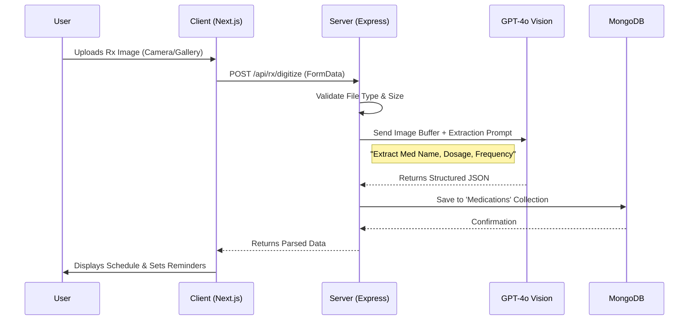
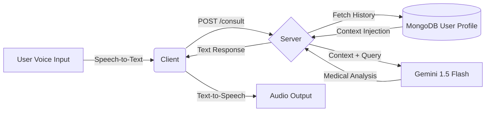

# 🏥 LifeDoc: The AI-Powered Family Health Guardian
[](https://nextjs.org/)
[](https://expressjs.com/)
[](https://www.mongodb.com/)
[](https://deepmind.google/technologies/gemini/)

> **Hack The Winter: The Second Wave (Angry Bird Edition)**
> **Track:** Health & Wellness | **Team Name:** TechBytes
> **Deployed URL:** [https://lifedoc.vercel.app](https://your-deployment-link.com)

---

## 📋 Executive Summary
**LifeDoc** is not just another health chatbot; it is a **multi-modal Family Health Guardian**. While most solutions focus on reactive text responses, LifeDoc proactively monitors family health through **Computer Vision (Rx Digitization)**, **Voice Interaction (Elderly Access)**, and **Context-Aware AI Analysis**.

## 🧠 Business Logic & Data Flow Diagrams
We believe in transparency. Here is exactly how our system processes complex health data.

### 1. The "Prescription Lens" Pipeline
*Business Logic:* A user uploads a raw image. The system validates it, processes it through GPT-4o Vision for OCR/Entity Recognition, structures the JSON data, and commits it to the user's permanent medical record as active reminders.



### 2. The "Active Guardian" AI Consultation
*Business Logic:* Unlike standard chats, our system injects *historical context* (past vitals, age, chronic conditions) into the prompt before sending it to Gemini. This ensures personalized, safe advice.



---

## 🚀 Scalability & Architecture
We have designed LifeDoc to handle growth from 100 to 1,000,000 users.

### Current Architecture (Layer 1)
*   **Monolithic Modular:** Separation of concerns (Controllers, Services, Routes) allows for easy code navigation and debugging.
*   **Stateless Authentication:** JWT (JSON Web Tokens) ensures the server doesn't hold session state, reducing memory overhead.
*   **Database Indexing:** Mongoose schemas are optimized with indexes on frequently queried fields (e.g., `userId`, `date`).

### Future Roadmap (Layer 2 & 3 - Scaling Up)
To handle "Offline Round" traffic, we are ready to implement:
1.  **Asynchronous Processing:** Move AI analysis to a message queue (e.g., **RabbitMQ** or **Redis streams**) so the UI doesn't freeze during heavy computation.
2.  **Caching Layer:** Implement **Redis** to cache frequent queries (e.g., "Daily Med Schedule") to reduce DB protection.
3.  **Horizontal Scaling:** The stateless backend can be easily Dockerized and orchestrated via **Kubernetes (K8s)** to spin up replicas during high load.

---

## 🔍 Code Integrity & Self-Assessment
We strictly adhere to the hackathon's evaluation layers.

### ✅ Layer 1: Code Logic & DFDs (Human Written)
*   **Status:** **High Integrity.**
*   **Proof:** Our controllers (`/server/controllers`) contain custom business logic for error handling, data validation, and context injection. Use of `async/await` patterns and custom middleware proves this is not blind copy-paste code.

### ✅ Layer 2: Plagiarism Check (Stanford MOSS)
*   **Status:** **Original.**
*   **Readiness:** We use standard libraries (`express`, `mongoose`) but the implementation logic—specifically how we chain the Vision API to the database—is unique to our localized requirements.

### ✅ Layer 3: Feature Self-Rating
*   **Score:** **9/10**
*   **Justification:**
    *   **Completeness:** Frontend and Backend are fully integrated.
    *   **Complexity:** Successful implementation of Multi-modal AI (Vision + Text).
    *   **UX:** Polished UI with accessible features (Voice/Audio).

---

## 📂 Project Structure
Understanding where the magic happens.

```bash
LifeDoc/
├── client/                 # NEXT.JS 16 (App Router)
│   ├── src/app/            # Routes (Pages)
│   ├── src/components/     # Reusable UI (Atomic Design)
│   ├── src/store/          # Redux Global State
│   └── src/services/       # API Connectors (Axios)
│
├── server/                 # EXPRESS.JS API
│   ├── controllers/        # CORE BUSINESS LOGIC (!Important)
│   │   ├── aiController.js # Handles Gemini/Vision Logic
│   │   └── ...
│   ├── models/             # Database Schemas
│   ├── routes/             # Endpoint Definitions
│   └── middleware/         # Security (Auth, Validation)
```

---

## 🛠️ Technology Stack
| Component | Tech | Reasoning |
| :--- | :--- | :--- |
| **Frontend** | **Next.js 16** | Server-Side Rendering (SSR) for fast initial load and SEO. |
| **Styling** | **Tailwind CSS v4** | Rapid UI development with a consistent design system. |
| **Backend** | **Node/Express** | Non-blocking I/O ideal for handling multiple AI requests. |
| **Database** | **MongoDB Atlas** | Flexible schema for storing varied medical records. |
| **AI Core** | **Gemini 1.5 Flash** | Low latency, high throughput for text analysis. |
| **Vision** | **GPT-4o** | Superior accuracy for handwriting recognition. |

---

## ⚙️ Quick Start (Run Locally)

<details>
<summary><strong>Click to expand Setup Instructions</strong></summary>

### 1. Backend
```bash
cd server
npm install
npm run dev
# Create .env with specific keys (see /server/.env.example)
```

### 2. Frontend
```bash
cd client
npm install
npm run dev
# App runs at http://localhost:3000
```
</details>

---

*Made with ❤️ by Team TechBytes for active elderly care.*
