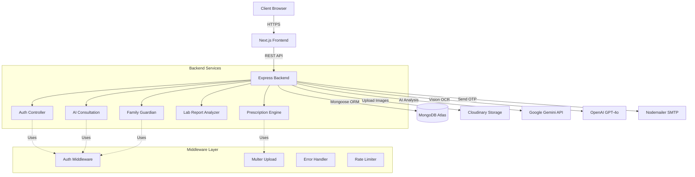
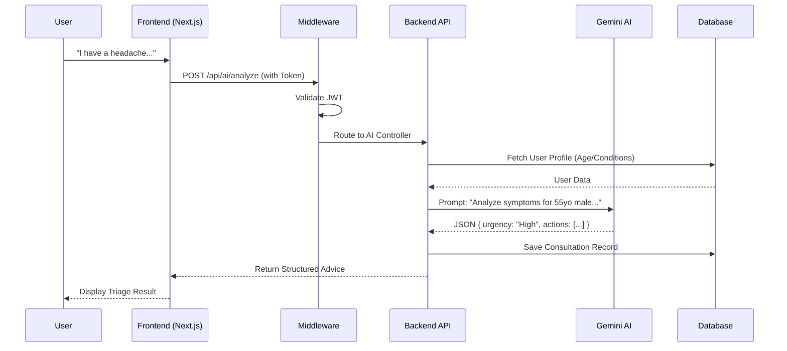

# 🏥 LifeDoc: The AI-Powered Family Health Guardian

<!-- LLM-OPTIMIZED-SUMMARY-START -->
> **Project Name:** LifeDoc
> **Hackathon:** Hack The Winter: The Second Wave (Angry Bird Edition)
> **Track:** Health & Wellness
> **Submission Type:** Round 1 Prototype
> **Key Tech Stack:** Next.js 16, Express, MongoDB, Google Gemini 1.5 Flash, GPT-4o Vision, Redux Toolkit.
> **Unique Selling Point (USP):** Active AI Health Guardian for Families with specialized Prescription Digitization.
<!-- LLM-OPTIMIZED-SUMMARY-END -->


## 📋 Executive Summary
**Problem:** Healthcare data is fragmented and unintelligible to patients. Families lack a centralized system to proactively monitor the health of elderly members.
**Solution:** LifeDoc is an AI-first platform that centralizes records, translates medical jargon into plain English using Gemini AI, and provides real-time risk analysis for family guardians.

---

## 🚀 Round 1: Core Features (The "Why" & "How")

### 1. 🗣️ AI Speak & Voice Interaction (Accessibility First)
> *"Technology should adapt to people, not the other way around."*

*   **The Real-World Problem:**
    *   **Literacy Barriers:** Many rural users cannot read complex medical text.
    *   **Age Factor:** Elderly users often struggle to type on small smartphone screens due to shaky hands or poor eyesight.
    *   **Language:** Medical advice is often in English, which might not be the user's first language.
*   **The LifeDoc Solution:**
    *   **Text-to-Speech:** After analyzing a prescription, the app **speaks out** the instructions (e.g., *"Take the white tablet after dinner"*).
    *   **Voice Commands (Planned):** Users can simply speak to the app ("I have a headache") instead of typing, making healthcare accessible to the 70+ demographic.

### 2. 🤖 Dr. Gemini (Intelligent Symptom Triage)
*   **The Real-World Problem:**
    *   **Dr. Google Panic:** Searching symptoms online often leads to scary, incorrect self-diagnoses.
    *   **Hospital Overcrowding:** People rush to the ER for minor issues (indigestion) or ignore major ones (chest pain).
*   **The LifeDoc Solution:**
    *   An AI that acts like a **sensible Family Doctor**. It uses **Context-Injection** (knowing your age, gender, and history) to give personalized advice.
    *   **Outcome:** Reduces anxiety by clearly stating: *"This is likely a migraine (Low Risk). Rest in a dark room."*

### 3. 💊 Smart Prescription Lens (Computer Vision)
*   **The Real-World Problem:**
    *   **The "Shoebox" Effect:** Patients lose physical prescription papers.
    *   **Bad Handwriting:** Doctors' handwriting is notoriously hard to read, leading to medication errors.
    *   **Forgetfulness:** Elderly patients often forget *when* to take which medicine.
*   **The LifeDoc Solution:**
    *   Scan the paper once using **GPT-4o Vision**.
    *   The app digitizes it into a **Structured Schedule** (Morning/Afternoon/Night) and sets auto-reminders. No more lost papers, no more missed doses.

### 4. 🛡️ Family Health Dashboard (The Guardian)
*   **The Real-World Problem:**
    *   **Distance:** Children working in cities often have no clue about their parents' health in the village until a crisis hits.
    *   **Reactive Care:** We only treat sickness; we don't prevent it.
*   **The LifeDoc Solution:**
    *   A **Shared Family View**. You can see your father's BP trends from 1000 miles away.
    *   **Proactive Alerts:** If the trend line goes up over 7 days, the AI warns the family group *before* a heart attack happens.

### 5. 🔬 Smart Lab Reports (Jargon Translator)
*   **The Real-World Problem:**
    *   **Confusion:** Reports say *"Neutrophils: 40%"* or *"HbA1c: 7.2"*. Most people have zero idea if this is good or bad without visiting a doctor.
*   **The LifeDoc Solution:**
    *   AI translates this into **Plain English**: *"Your sugar levels indicate Pre-Diabetes. You need to cut down on carbs and walk more."*
    *   Empowers users to understand their own body.

---

## 🛠️ System Architecture (Mandatory Diagrams)

### A. System Architecture


### B. Data Flow Architecture


---

## 🔮 Round 2 Plan: "The Slingshot" (Mandatory)

We have a clear path to scale from **Monitoring** to **Action**.

> **See Full Feature List (8+ Items): [Round 2 Roadmap](./docs/ROUND2_PLAN.md)**

### 🏆 Top 3 Game-Changing Features
| Feature | The "Why" (Need) | Implementation Plan |
| :--- | :--- | :--- |
| **🚨 Emergency SOS** | **Critical Safety.** If an elderly user collapses, minutes matter. | **Twilio API:** Triggers SMS/WhatsApp to all family admins with a Live Maps Link. |
| **🏥 Pharmacy Connect** | **Convenience.** Sick patients shouldn't queue at pharmacies. | **Partner API:** Auto-forward digitized prescriptions to local pharmacies for 1-hour delivery. |
| **🗣️ Voice-First Mode** | **Accessibility.** Many elderly cannot type on touchscreens. | **Web Speech API:** Full voice-command control ("Hey LifeDoc, log my BP as 120/80"). |

*(Other planned features: Wearable Sync, Mental Health AI, Gamification, and Blockchain Health Records - see full doc)*

---

## 💻 Technology Stack

| Layer | Technologies Used |
| :--- | :--- |
| **Frontend** | **Next.js 16** (App Router), **Redux Toolkit** (State), **Tailwind CSS v4** (Styling) |
| **Backend** | **Node.js**, **Express.js v5**, **JWT** (Secure Auth) |
| **Database** | **MongoDB Atlas** (Mongoose ODM) |
| **AI Models** | **Google Gemini 1.5 Flash** (Text/Analysis), **GPT-4o** (Vision) |
| **Cloud** | **Cloudinary** (Secure Image Storage), **Vercel** (Deployment) |

---

## ⚙️ How to Run Locally

1.  **Clone & Install**
    ```bash
    git clone https://github.com/your-repo/LifeDoc.git
    cd LifeDoc
    ```

2.  **Environment Setup (`server/.env`)**
    ```env
    MONGO_URI=mongodb+srv://...
    GEMINI_API_KEY=AIzaSy...
    OPENAI_API_KEY=sk-proj...
    CLOUDINARY_URL=cloudinary://...
    JWT_SECRET=supersecret
    ```

3.  **Run System**
    *   **Server:** `cd server && npm run dev` (Port 5000)
    *   **Client:** `cd client && npm run dev` (Port 3000)

---

## 👥 The Team
*   **Mohit Soni**: AI Integration & Backend Architecture
*   **Arya Patel**: Frontend UI/UX & State Management
*   **Ishita Trivedi**: Database Design & Documentation
*   **Visha Trivedi**: Database Design & Documentation

---
*Built with ❤️ for generic health & wellness.*
