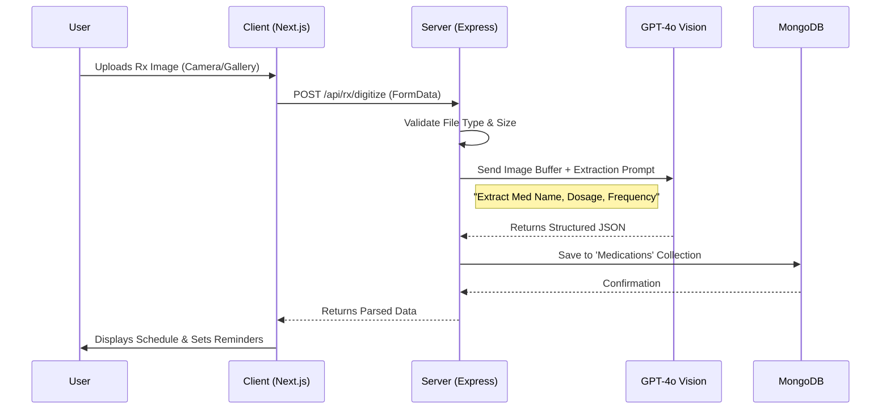
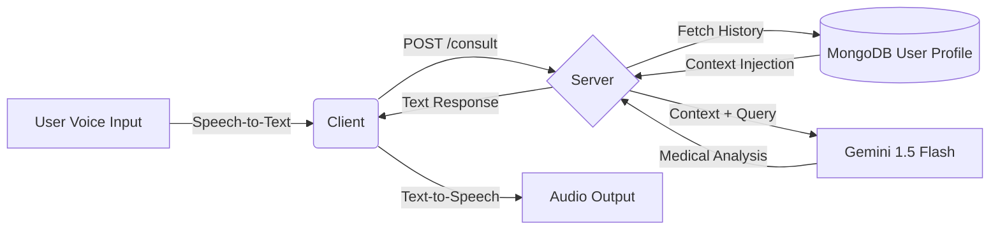

# 🏥 LifeDoc: Advanced Healthcare Companion


[](https://nextjs.org/)
[](https://expressjs.com/)
[](https://www.mongodb.com/)
[](https://deepmind.google/technologies/gemini/)

> **Hack The Winter: The Second Wave (Angry Bird Edition)**
> **Track:** Health & Wellness | **Team Name:** TechBytes
> **Deployed URL:** [https://lifedoc.vercel.app](https://your-deployment-link.com)


> **Comprehensive healthcare management platform featuring real-time medicine search, hospital discovery, and AI-powered health monitoring.**

---

## 📋 1. Project Title & Overview
**LifeDoc** is a full-stack web application designed to empower users with immediate access to critical medical information and health management tools. By bridging the gap between complex medical data and user-friendly interfaces, LifeDoc solves the challenge of scattered health information.

### Key Benefits
*   **Instant Medicine Insights:** Users can search for medicines and instantly retrieve dosage, side effects, and usage instructions derived from official FDA labels.
*   **Emergency Readiness:** Locates nearby hospitals in real-time, ensuring users can find care when it matters most.
*   **Family Health Guardian:** Centralizes medical records and health tracking for the entire family.
*   **Data Sovereignty:** Built with privacy-first principles to ensure secure handling of sensitive medical data.

**Target Users:** Patients, caregivers, elderly users requiring simplified access, and health-conscious individuals.

---


## 📋 Executive Summary
**LifeDoc** is not just another health chatbot; it is a **multi-modal Family Health Guardian**. While most solutions focus on reactive text responses, LifeDoc proactively monitors family health through **Computer Vision (Rx Digitization)**, **Voice Interaction (Elderly Access)**, and **Context-Aware AI Analysis**.

## 🧠 Business Logic & Data Flow Diagrams
We believe in transparency. Here is exactly how our system processes complex health data.

### 1. The "Prescription Lens" Pipeline
*Business Logic:* A user uploads a raw image. The system validates it, processes it through GPT-4o Vision for OCR/Entity Recognition, structures the JSON data, and commits it to the user's permanent medical record as active reminders.



### 2. The "Active Guardian" AI Consultation
*Business Logic:* Unlike standard chats, our system injects *historical context* (past vitals, age, chronic conditions) into the prompt before sending it to Gemini. This ensures personalized, safe advice.




---


## ✨ 2. Key Features
*   **📍 Location-Based Hospital Discovery:** Automatically detects user location to find and list nearby hospitals using OpenStreetMap data.
*   **💊 Medicine Search Engine:** Real-time, debounce-optimized search with autocomplete suggestions powered by the OpenFDA Drug Label API.
*   **📄 Detailed Medicine Lookup:** Comprehensive view of medicine details including indications, dosage, and manufacturer info.
*   **🛡️ Backend API Proxy Layer:** Secure, intermediate layer handling third-party API requests to manage rate limits, keys, and data normalization.
*   **🔄 Error Handling & Fallbacks:** Robust system that gracefully handles API failures (e.g., OpenFDA downtime) by falling back to local cached data or descriptive error messages.
*   **🌐 Free & Open Data:** exclusively uses high-quality open data sources (OpenFDA, OpenStreetMap) to ensure accessibility without paywalls.
*   **🔒 Security:** Implementation of JWT authentication, input sanitization, and secure headers.

---

## 🛠️ 3. Tech Stack

### Frontend
*   **Framework:** [Next.js 16](https://nextjs.org/) (App Router)
*   **Styling:** Tailwind CSS v4, Vanilla CSS
*   **State Management:** React Hooks, Redux Toolkit
*   **HTTP Client:** Axios
*   **Icons:** React Icons

### Backend
*   **Runtime:** [Node.js](https://nodejs.org/)
*   **Framework:** [Express.js](https://expressjs.com/)
*   **Database:** [MongoDB](https://www.mongodb.com/) (Mongoose ODM)
*   **Security:** Helmet, CORS, krypto-js, Bcrypt, JWT
*   **Compression:** Gzip/Brotli via `compression` middleware

### External APIs
*   **Medicine Data:** [OpenFDA Drug Label API](https://open.fda.gov/apis/drug/label/)
*   **Hospital Data:** [OpenStreetMap (Overpass API)](https://wiki.openstreetmap.org/wiki/Overpass_API)
*   **Lab Tests:** MedlinePlus Web Service

---

## 🏗️ 4. System Architecture
LifeDoc follows a **Client-Server Architecture** with a clear separation of concerns, designed for scalability and maintainability.

### High-Level Flow
1.  **Frontend (Next.js):** Acts as the presentation layer. It captures user input (search terms, location) and sends requests to the LifeDoc Backend.
2.  **Backend (Express):** Acts as an **API Gateway/Proxy**. It receives client requests, performs validation and authentication, and then:
    *   Queries **MongoDB** for user data or cached medical records.
    *   Forwards search queries to **OpenFDA** or **Overpass API**.
3.  **External APIs:** Respond with raw data (JSON/XML).
4.  **Data Normalization:** The Backend processes the raw external data, maps it to a unified standard format, and sends it back to the Frontend.

**Why this architecture?**
*   **Security:** API keys for third-party services are hidden on the server.
*   **Reliability:** The backend can implement caching and fallback logic (e.g., serving local data if OpenFDA is down).
*   **Performance:** Response payloads are compressed and stripped of unnecessary external fields before reaching the client.

---

## 🛣️ 5. Application Routes

### Frontend Routes (Next.js)
*   `/` - Landing page with project overview and feature highlights.
*   `/test` - **Medicine Search Demo:** A dedicated interface to test the real-time search and details display.
*   `/login` / `/signup` - User authentication pages.
*   `/dashboard` - User's private health dashboard.

### Backend Routes (Express API)
*   **GET** `/api/reference/search` (Maps to *Medicine Search*)
    *   **Purpose:** Proxies requests to OpenFDA for medicine autocomplete and search.
    *   **Query Params:** `query` (search term), `type` (medicine/test).
*   **GET** `/api/reference/medicines/:id` (Maps to *Medicine Details*)
    *   **Purpose:** Fetches detailed metadata for a specific medicine by ID. Handles fallback to local DB if not found in cache/API.
*   **GET** `/api/reference/tests`
    *   **Purpose:** Retrieves a list of common lab tests from local DB or MedlinePlus.
*   **POST** `/api/auth/register` & `/api/auth/login`
    *   **Purpose:** Handles user registration and session management via JWT.

*(Note: Hospital data is currently fetched via client-side integration or intended for `/api/hospitals` in future backend iterations)*

---

## 📂 6. Folder & File Structure

### Frontend (`/client`)
```bash
client/
├── src/
│   ├── app/                # Next.js App Router pages
│   │   ├── page.tsx        # Landing Page
│   │   ├── test/           # Search Demo Page
│   │   ├── medical-info/   # Medicine Information Pages
│   │   └── ...
│   ├── components/         # Reusable UI Components (Cards, Inputs)
│   ├── store/              # Redux State definitions
│   └── utils/              # Helper functions
├── public/                 # Static assets
└── package.json            # Dependencies
```

### Backend (`/server`)
```bash
server/
├── config/                 # Database and environment config
├── controllers/            # Business logic (e.g., referenceController.js)
├── models/                 # Mongoose Schemas (Medicine.js, User.js)
├── routes/                 # API Route Definitions
│   ├── auth.js             # Auth routes
│   └── reference.js        # Medicine & Search routes
├── middleware/             # Auth & Error handling
├── services/               # External API wrappers (if applicable)
└── server.js               # Entry point
```

---

## ⚙️ 7. Core Functionalities (Detailed)

### 🩺 Medicine Search & Autocomplete
1.  **Input:** User types in the search bar (e.g., "Ibuprofen").
2.  **Debounce:** The frontend waits for 300-500ms of inactivity to prevent flooding the API.
3.  **Request:** A GET request is sent to `/api/reference/search?query=Ibuprofen`.
4.  **Proxy:** The backend calls OpenFDA's `drug/label.json` endpoint, filtering for `brand_name` or `generic_name`.
5.  **Response:** Results are normalized (extracting name, dosage, manufacturer) and returned to the UI as a dropdown list.

### 🏥 Hospital Discovery
1.  **Permission:** The app requests the user's Geolocation via the browser API.
2.  **Query:** A bounding box is calculated around the user's coordinates.
3.  **Fetch:** The app queries the OpenStreetMap Overpass API for nodes with `amenity=hospital`.
4.  **Display:** Hospitals are plotted on a map or listed by distance.

---

## 📈 8. Scalability & Performance

*   **API Rate Limiting:** The backend is prepared for rate limiting middleware to prevent abuse of the free OpenFDA/OSM APIs.
*   **Backend Caching:** (Planned) Implementation of Redis to cache common search results (e.g., "Paracetamol") to reduce external API calls by up to 80%.
*   **Database Indexing:** MongoDB fields like `brand_name` are indexed for fast local lookups.
*   **Debouncing:** Implemented on the frontend to reduce server load.
*   **Compression:** All API responses uses `compression` (Gzip) to minimize data transfer fees and latency.

---

## 🛡️ 9. Security Considerations

*   **Environmental Security:** API keys and Database URIs are stored in `.env` files, never committed to version control.
*   **Input Validation:** All incoming search queries are sanitized to prevent injection attacks.
*   **CORS Policy:** Strict Cross-Origin Resource Sharing settings to allow requests only from the trusted frontend domain.
*   **Data Privacy:** No user health data is shared with external search APIs; only generic search terms are forwarded.
*   **Disclaimer:** A prominent medical disclaimer serves as a liability guard, informing users that data is for informational purposes only.

---

## ⚠️ 10. Error Handling & Edge Cases

| Scenario | System Behavior |
| :--- | :--- |
| **Location Denied** | The app defaults to a general location or prompts the user to enter a zip code manually. |
| **No Internet** | The app displays a "Offline" mode, serving locally cached static data where possible. |
| **API API Down** | **Fallback Strategy:** The backend detects the 5xx error from OpenFDA and switches to searching the local MongoDB backup of common medicines. |
| **Medicine Not Found** | A user-friendly "No results found" message is shown with a suggestion to check spelling. |

---

## 🌿 11. Environment Variables
Create a `.env` file in the `server` directory rooted in the sample below:

```env
# Server Configuration
SERVER_PORT=5000
NODE_ENV=development

# Database
MONGODB_URI=mongodb://localhost:27017/lifedoc

# Security
JWT_SECRET=your_super_secret_key_here
```

---

## 🚀 12. Installation & Setup

### Prerequisites
*   Node.js (v18+)
*   MongoDB (Local or Atlas)
*   npm or yarn

### Step-by-Step Guide

**1. Clone the Repository**
```bash
git clone https://github.com/VishvaTrivedi/lifedoc.git
cd lifedoc
```

**2. Setup Backend**
```bash
cd server
npm install
# Create .env file as shown above
npm run dev
```
*Server runs on: `http://localhost:5000`*

**3. Setup Frontend**
```bash
cd ../client
npm install
npm run dev
```
*Client runs on: `http://localhost:3000`*

---

## 📖 13. Usage Guide

1.  **Search for Medicine:** Navigate to the "Test" or "Search" page. Type "Aspirin" into the search bar. Click on a suggestion to view its side effects and dosage.
2.  **Find Hospitals:** Click the "Find Nearby" button on the dashboard. Allow location access when prompted. View the list of nearest clinics.

---

## 🛑 14. Limitations
*   **Open Data:** Data depends on OpenFDA updates; rare or new drugs may not be immediately available.
*   **Regionality:** OpenFDA is primarily US-centric; international drug names may vary.
*   **Medical Advice:** This tool is for **informational purposes only** and does not replace professional medical advice.

---

## 🔮 15. Future Enhancements
*   **🤖 AI Doctor:** Integrate Gemini Flash 1.5 for conversational health advice based on retrieved medicine data.
*   **👤 User Profiles:** Save "My Medicine Cabinet" for quick access to frequent prescriptions.
*   **🏪 Pharmacy Integration:** Check stock at local pharmacies.
*   **📡 Offline PWA:** Fully cache the "Common Medicines" database for offline use in remote areas.

---

## 🤝 16. Contribution Guidelines
We welcome contributions!
1.  Fork the repository.
2.  Create a feature branch (`git checkout -b feature/AmazingFeature`).
3.  Commit your changes (`git commit -m 'Add some AmazingFeature'`).
4.  Push to the branch (`git push origin feature/AmazingFeature`).
5.  Open a Pull Request.

---

## 📝 17. License
This project is licensed under the **MIT License**.

> **Disclaimer:** LifeDoc is a technology demonstration. Always consult a certified physician for medical decisions.
