# 🏥 LifeDoc: AI-Powered Family Health Guardian

<div align="center">

[](https://nextjs.org/)
[](https://expressjs.com/)
[](https://www.mongodb.com/)
[](https://deepmind.google/technologies/gemini/)
[](https://www.typescriptlang.org/)

**Comprehensive AI-powered healthcare platform featuring symptom analysis, prescription digitization, family health monitoring, and intelligent medical insights.**

[Live Demo](https://lifedoc.vercel.app) • [Documentation](#-api-documentation) • [Report Bug](#) • [Request Feature](#)

</div>

---

## 📋 Table of Contents

- [Overview](#-overview)
- [Features](#-features)
- [System Architecture](#-system-architecture)
- [Database Schema](#-database-schema)
- [System Flow](#-system-flow)
- [User Roles](#-user-roles)
- [Tech Stack](#-tech-stack)
- [API Documentation](#-api-documentation)
- [Project Structure](#-project-structure)
- [Security Best Practices](#-security-best-practices)
- [Installation](#-installation--setup)
- [Commands Reference](#-commands-reference)
- [Environment Variables](#-environment-variables)
- [Roadmap](#-roadmap)
- [Contributing](#-contributing)
- [License](#-license)

---

## 📖 Overview

**LifeDoc** is a next-generation healthcare management platform that transforms how families manage their health data. By combining advanced AI (Google Gemini, OpenAI Vision), intelligent document processing, and family-centric features, LifeDoc bridges the gap between complex medical information and actionable health insights.

### 🎯 Core Value Proposition

- **🤖 AI-Powered Health Assistant**: Instant symptom analysis with personalized recommendations using Google Gemini 1.5 Flash
- **📸 Smart Document Digitization**: Convert prescriptions and lab reports into structured data using Vision AI
- **👨‍👩‍👧‍👦 Family Health Management**: Centralized health tracking for entire families with role-based access control
- **📊 Intelligent Health Analytics**: Track vitals, medications, and generate AI-powered health summaries
- **🔒 Privacy-First Design**: End-to-end encryption with user data sovereignty
- **🚨 Emergency Features**: SOS alerts with real-time location sharing to family members

### 🎯 Target Users

- **Patients**: Individuals managing chronic conditions or seeking medical guidance
- **Caregivers**: Family members managing health records for children or elderly parents
- **Doctors**: Healthcare professionals needing quick access to patient history
- **Seniors**: Elderly users requiring simplified, voice-enabled health tracking

---

## ✨ Features

### 🤖 AI-Powered Health Intelligence

#### Symptom Analysis & Consultation
- **Intelligent Symptom Checker**: Multi-lingual AI consultation (English, Hindi, Gujarati) with urgency assessment
- **Contextual Health Advice**: Personalized recommendations based on user's medical history and chronic conditions
- **Urgency Classification**: Automatic triage (Low/Medium/High) with actionable next steps
- **Lifestyle Recommendations**: AI-generated wellness tips tailored to user's condition
- **Token Tracking**: Monitor AI usage and estimated costs for transparency

#### Prescription Digitization
- **Computer Vision OCR**: Extract medicine names, dosages, and schedules from prescription photos
- **Multi-Format Support**: Process handwritten prescriptions, printed reports, and PDF documents
- **Automated Medication Reminders**: Set up schedules automatically from scanned prescriptions
- **Medicine Database Integration**: Auto-complete and validate medicine names

#### Lab Report Analysis
- **Intelligent Document Parsing**: Extract structured data from lab reports (images/PDFs)
- **Reference Range Comparison**: Automatic flagging of out-of-range values
- **Trend Analysis**: Track biomarkers over time with visual charts
- **AI-Powered Insights**: Plain-language explanations of lab results

### 👨‍👩‍👧‍👦 Family Health Management

#### Multi-Member Support
- **Family Profiles**: Manage health records for up to 5 family members
- **Role-Based Access Control**: Admin, Caregiver, Member, Child, View-Only roles
- **Linked vs Managed Accounts**: Support for independent accounts and dependent profiles
- **Invitation System**: Email-based invitations with approval workflow
- **Aggregate Health Dashboard**: View family-wide health trends and alerts

#### Health Data Tracking
- **Vital Signs Monitoring**: Blood pressure, glucose, heart rate, weight, temperature, SpO2
- **Medication Tracking**: Active prescriptions with dosage schedules and reminders
- **Appointment Management**: Schedule and track doctor visits, lab tests
- **Health Diary**: AI-summarized daily health logs with mood tracking
- **Document Storage**: Secure cloud storage for all medical documents

### 🏥 Medical Information & Resources

#### Medicine Search & Reference
- **Real-Time Search**: Autocomplete-enabled medicine search powered by OpenFDA
- **Detailed Drug Information**: Dosage, side effects, interactions, and manufacturer details
- **Lab Test Reference**: Comprehensive database of common lab tests and their purposes
- **Health News Feed**: Curated medical news from trusted sources updated daily

#### Emergency Features
- **SOS Alert System**: One-tap emergency alerts to designated contacts
- **Real-Time Location Sharing**: GPS coordinates sent via SMS to emergency contacts
- **Emergency Contact Management**: Store and manage up to 5 emergency contacts
- **Critical Threshold Alerts**: Automatic notifications for dangerous vital sign readings

### 🔒 Security & Privacy

#### Data Protection
- **JWT Authentication**: Secure token-based authentication with OTP verification
- **Bcrypt Password Hashing**: Industry-standard password encryption
- **Role-Based Authorization**: Granular access control for different user types
- **CORS Protection**: Strict cross-origin resource sharing policies
- **Input Sanitization**: Prevent injection attacks and XSS vulnerabilities

#### Compliance & Standards
- **HIPAA-Ready Architecture**: Designed with healthcare data protection in mind
- **Audit Logging**: Track all access to sensitive medical data
- **Data Encryption**: AES-256 encryption for data at rest
- **Secure File Upload**: Validated and sanitized file uploads to Cloudinary

### 🎨 User Experience

#### Modern Interface
- **Responsive Design**: Optimized for mobile, tablet, and desktop
- **Dark Mode Support**: Eye-friendly interface for night-time use
- **Guided Onboarding**: Interactive tour for new users using React Joyride
- **Progressive Web App (PWA)**: Install and use offline
- **Voice Navigation**: Accessibility features for elderly and visually impaired users

#### Multilingual Support
- **Language Options**: English, Hindi, Gujarati interface translations
- **AI Multilingual Response**: Symptom analysis available in multiple languages
- **Localized Date/Time**: Regional formatting for dates and measurements

---

## 🏗️ System Architecture

LifeDoc follows a modern **3-tier client-server architecture** with clear separation of concerns, microservice-ready design patterns, and scalable infrastructure.


### System Components

#### Frontend (Next.js 16 - App Router)
- **Framework**: React 18 with Next.js 16 App Router
- **State Management**: Redux Toolkit for global state
- **Styling**: Tailwind CSS v4 with custom design system
- **Type Safety**: Full TypeScript implementation
- **HTTP Client**: Axios with interceptors for auth tokens

#### Backend (Express.js 5)
- **Framework**: Express.js with RESTful API design
- **Authentication**: JWT-based stateless authentication
- **Middleware Stack**: CORS, Helmet, Compression, Multer
- **Database**: Mongoose ODM for MongoDB
- **Validation**: Request validation and sanitization

#### Key Architectural Patterns
- **API Gateway Pattern**: Single entry point for all requests
- **Service Layer Pattern**: Business logic isolation
- **Repository Pattern**: Data access abstraction
- **Middleware Chain Pattern**: Modular request processing

---

## 💾 Database Schema

### Entity Relationship Diagram (ERD)


### Core Collections

#### User Collection
```javascript
{
  _id: ObjectId,
  name: String (required),
  email: String (unique, indexed),
  password: String (bcrypt hashed),
  age: Number,
  type: String (enum: ['user', 'doctor', 'admin']),
  isVerified: Boolean,
  profile: {
    gender: String,
    height: Number,
    weight: Number,
    bloodGroup: String,
    chronicConditions: [String]
  },
  sosContacts: [{ name, phone, email, relationship }],
  emergencySettings: { enableAutoAlert, criticalThresholds }
}
```

#### Consultation Collection
```javascript
{
  _id: ObjectId,
  user: ObjectId (ref: 'User', indexed),
  symptoms: String,
  aiSummary: String,
  urgency: String (enum: ['Low', 'Medium', 'High']),
  actions: [String],
  lifestyleAdvice: [String],
  suggestedMedicines: [String],
  tokenUsage: { promptTokens, completionTokens, totalTokens },
  reviewStatus: String (enum: ['none', 'pending', 'reviewed']),
  date: Date
}
```

#### Lab Report Collection
```javascript
{
  _id: ObjectId,
  userId: ObjectId (indexed),
  reportDate: Date,
  testType: String,
  parsedResults: Mixed, // AI-extracted structured data
  originalReport: String (Cloudinary URL),
  fileUrl: String,
  notes: String
}
```

### Database Indexes
```javascript
// Optimized queries
db.users.createIndex({ email: 1 }, { unique: true })
db.consultations.createIndex({ user: 1, date: -1 })
db.labreports.createIndex({ userId: 1, reportDate: -1 })
db.measurements.createIndex({ userId: 1, type: 1 })
```

### Key Enums & Data Types

```mermaid
graph LR
    subgraph UserTypes["👤 User Types"]
        UT1["user"]
        UT2["doctor"]
        UT3["admin"]
    end
    
    subgraph ConsultationUrgency["🚨 Consultation Urgency"]
        CU1["Low"]
        CU2["Medium"]
        CU3["High"]
    end
    
    subgraph MeasurementTypes["📊 Measurement Types"]
        MT1["blood_pressure"]
        MT2["glucose"]
        MT3["heart_rate"]
        MT4["weight"]
        MT5["temperature"]
        MT6["spo2"]
    end
    
    subgraph FamilyRoles["👨‍👩‍👧‍👦 Family Roles"]
        FR1["admin"]
        FR2["caregiver"]
        FR3["member"]
        FR4["child"]
        FR5["view_only"]
    end
    
    subgraph AppointmentStatus["📅 Appointment Status"]
        AS1["scheduled"]
        AS2["completed"]
        AS3["cancelled"]
        AS4["rescheduled"]
    end
    
    subgraph VerificationStatus["✅ Verification Status"]
        VS1["pending"]
        VS2["approved"]
        VS3["rejected"]
    end
    
    style UserTypes fill:#e3f2fd,stroke:#1565c0,stroke-width:3px,color:#000
    style ConsultationUrgency fill:#fff3e0,stroke:#e65100,stroke-width:3px,color:#000
    style MeasurementTypes fill:#e8f5e9,stroke:#2e7d32,stroke-width:3px,color:#000
    style FamilyRoles fill:#f3e5f5,stroke:#6a1b9a,stroke-width:3px,color:#000
    style AppointmentStatus fill:#fce4ec,stroke:#c2185b,stroke-width:3px,color:#000
    style VerificationStatus fill:#e0f2f1,stroke:#00695c,stroke-width:3px,color:#000
    
    style UT1 fill:#bbdefb,stroke:#1565c0,stroke-width:2px,color:#000
    style UT2 fill:#bbdefb,stroke:#1565c0,stroke-width:2px,color:#000
    style UT3 fill:#bbdefb,stroke:#1565c0,stroke-width:2px,color:#000
    style CU1 fill:#ffe0b2,stroke:#e65100,stroke-width:2px,color:#000
    style CU2 fill:#ffe0b2,stroke:#e65100,stroke-width:2px,color:#000
    style CU3 fill:#ffe0b2,stroke:#e65100,stroke-width:2px,color:#000
    style MT1 fill:#c8e6c9,stroke:#2e7d32,stroke-width:2px,color:#000
    style MT2 fill:#c8e6c9,stroke:#2e7d32,stroke-width:2px,color:#000
    style MT3 fill:#c8e6c9,stroke:#2e7d32,stroke-width:2px,color:#000
    style MT4 fill:#c8e6c9,stroke:#2e7d32,stroke-width:2px,color:#000
    style MT5 fill:#c8e6c9,stroke:#2e7d32,stroke-width:2px,color:#000
    style MT6 fill:#c8e6c9,stroke:#2e7d32,stroke-width:2px,color:#000
    style FR1 fill:#e1bee7,stroke:#6a1b9a,stroke-width:2px,color:#000
    style FR2 fill:#e1bee7,stroke:#6a1b9a,stroke-width:2px,color:#000
    style FR3 fill:#e1bee7,stroke:#6a1b9a,stroke-width:2px,color:#000
    style FR4 fill:#e1bee7,stroke:#6a1b9a,stroke-width:2px,color:#000
    style FR5 fill:#e1bee7,stroke:#6a1b9a,stroke-width:2px,color:#000
    style AS1 fill:#f8bbd0,stroke:#c2185b,stroke-width:2px,color:#000
    style AS2 fill:#f8bbd0,stroke:#c2185b,stroke-width:2px,color:#000
    style AS3 fill:#f8bbd0,stroke:#c2185b,stroke-width:2px,color:#000
    style AS4 fill:#f8bbd0,stroke:#c2185b,stroke-width:2px,color:#000
    style VS1 fill:#b2dfdb,stroke:#00695c,stroke-width:2px,color:#000
    style VS2 fill:#b2dfdb,stroke:#00695c,stroke-width:2px,color:#000
    style VS3 fill:#b2dfdb,stroke:#00695c,stroke-width:2px,color:#000
```



**Enum Definitions:**

| Category | Values | Description |
|----------|--------|-------------|
| **User Types** | `user`, `doctor`, `admin` | System-wide role classification |
| **Urgency** | `Low`, `Medium`, `High` | AI consultation priority levels |
| **Vital Types** | `blood_pressure`, `glucose`, `heart_rate`, `weight`, `temperature`, `spo2` | Supported vital sign measurements |
| **Family Roles** | `admin`, `caregiver`, `member`, `child`, `view_only` | Family access control levels |
| **Appointment Status** | `scheduled`, `completed`, `cancelled`, `rescheduled` | Appointment lifecycle states |
| **Verification Status** | `pending`, `approved`, `rejected` | Doctor verification workflow |

---

## 🔄 System Flow

### Complete User Journey


### Authentication Flow

**Secure OTP-based authentication with email verification**

1. User enters email and password
2. System generates 6-digit OTP (expires in 10 minutes)
3. OTP sent via email (Nodemailer)
4. User verifies OTP
5. JWT token generated and returned
6. Token stored in localStorage for subsequent requests

---

## 🤖 AI Workflow & Processing

### Complete AI Service Integration


### AI Service Details

#### 1. **Symptom Analysis** (`/api/ai/analyze`)

**Input:** Text symptoms (e.g., "Fever and headache for 3 days")

**Processing:**
1. **Rate Limit Check**: 20 requests per 15 minutes
2. **Context Loading**: Fetch user's chronic conditions and medication history
3. **Prompt Engineering**: Inject medical context into system prompt
4. **AI Call**: Google Gemini 1.5 Flash with temperature 0.7
5. **Token Tracking**: Monitor usage (promptTokens, completionTokens, totalTokens)
6. **Urgency Classification**: Low/Medium/High based on symptom severity
7. **Action Generation**: Immediate steps, lifestyle advice, medicine suggestions

**Output:** 
```json
{
  "summary": "Analysis of symptoms...",
  "urgency": "Medium",
  "actions": ["Take paracetamol", "Rest for 24 hours"],
  "lifestyleAdvice": ["Stay hydrated"],
  "suggestedMedicines": ["Paracetamol 500mg"],
  "tokenUsage": { "totalTokens": 450 }
}
```

#### 2. **Prescription OCR** (`/api/ai/analyze-prescription`)

**Input:** Image URL (from Cloudinary)

**Processing:**
1. **Image Validation**: Check format (JPEG, PNG), size (< 10MB)
2. **Vision API Call**: OpenAI GPT-4 Vision with specialized prompt
3. **Text Extraction**: Parse medicine names, dosages, frequencies
4. **Database Validation**: Cross-reference with OpenFDA medicine database
5. **Schedule Generation**: Convert "twice daily" → reminder schedule

**Output:**
```json
{
  "medicines": [
    {
      "name": "Metformin",
      "dosage": "500mg",
      "frequency": "Twice daily",
      "duration": "30 days"
    }
  ],
  "doctorName": "Dr. Sarah Johnson"
}
```

#### 3. **Lab Report Analysis** (`/api/ai/analyze-lab-report`)

**Input:** PDF/Image of lab report

**Processing:**
1. **File Parsing**: Extract text from PDF using pdf-parse
2. **Vision OCR**: Use OpenAI Vision for handwritten/image reports
3. **Data Structuring**: Extract test names, values, reference ranges
4. **Abnormality Detection**: Flag out-of-range values
5. **Trend Analysis**: Compare with previous reports

**Output:**
```json
{
  "tests": [
    {
      "testName": "Hemoglobin",
      "value": 12.5,
      "unit": "g/dL",
      "referenceRange": "13-17",
      "status": "low"
    }
  ],
  "abnormalTests": 1
}
```

#### 4. **Diary Summarization** (`/api/ai/summerizer`)

**Input:** Daily health diary entry (text)

**Processing:**
1. **Load User Context**: Fetch recent health events
2. **Sentiment Analysis**: Detect mood from text
3. **AI Summarization**: Google Gemini condenses entry
4. **Tag Generation**: Extract health keywords

**Output:**
```json
{
  "summary": "User reported mild headache...",
  "mood": "neutral",
  "tags": ["headache", "fatigue", "sleep"]
}
```

### AI Cost & Token Management

**Token Tracking:**
- Every AI request logs token usage in `Consultation` model
- Admin dashboard shows total tokens consumed
- Estimated cost calculation: `(totalTokens / 1000) * $0.01`

**Optimization Strategies:**
- Cache common symptom queries for 5 minutes
- Reuse extracted prescription data to avoid re-processing
- Implement prompt compression to reduce input tokens
- Use Gemini Flash (cheaper) for simple tasks, GPT-4 for complex OCR

---

## 👥 User Roles

LifeDoc implements a role-based access control (RBAC) system with three primary user types and five family role levels.

```mermaid
graph TD
    Users[All Users] --> Regular[Regular User]
    Users --> Doctor[Verified Doctor]
    Users --> Admin[System Admin]
    
    Regular --> Features1[✓ Personal Health Records<br/>✓ AI Consultations<br/>✓ Family Management<br/>✓ Vital Tracking]
    
    Doctor --> Features2[✓ All Regular Features<br/>✓ Review Consultations<br/>✓ Meeting Requests<br/>✓ Professional Badge]
    
    Admin --> Features3[✓ All Features<br/>✓ User Management<br/>✓ Doctor Verification<br/>✓ System Analytics<br/>✓ Medical DB Management]
    
    style Users fill:#f5f5f5,stroke:#424242,stroke-width:3px,color:#000
    style Regular fill:#e3f2fd,stroke:#1565c0,stroke-width:3px,color:#000
    style Doctor fill:#fff3e0,stroke:#e65100,stroke-width:3px,color:#000
    style Admin fill:#ffebee,stroke:#c62828,stroke-width:3px,color:#000
    style Features1 fill:#bbdefb,stroke:#1565c0,stroke-width:2px,color:#000
    style Features2 fill:#ffe0b2,stroke:#e65100,stroke-width:2px,color:#000
    style Features3 fill:#ffcdd2,stroke:#c62828,stroke-width:2px,color:#000
```



### Role Definitions

#### 1. **Regular User** (`type: 'user'`)

**Permissions:**
- ✅ Create and manage personal health records
- ✅ Use AI consultation features
- ✅ Upload prescriptions and lab reports
- ✅ Track vitals and measurements
- ✅ Create family group (becomes admin of that family)
- ✅ Schedule appointments
- ✅ Configure emergency SOS contacts

**Restrictions:**
- ❌ Cannot review other users' AI consultations
- ❌ Cannot access admin dashboard
- ❌ Cannot manage doctor verification

#### 2. **Verified Doctor** (`type: 'doctor'`)

**Additional Permissions:**
- ✅ All regular user permissions
- ✅ Review flagged AI consultations
- ✅ Provide professional feedback on cases
- ✅ Request admin meetings for collaboration
- ✅ Access pending consultation review queue
- ✅ Professional badge display on profile

**Verification Process:**
1. User applies via doctor verification form
2. Upload 3 documents: Medical License, ID, Degree
3. Admin reviews application
4. Status changes: `pending` → `approved` or `rejected`
5. User type automatically updated to `doctor` upon approval

#### 3. **System Admin** (`type: 'admin'`)

**Full Permissions:**
- ✅ All user and doctor permissions
- ✅ Access admin dashboard
- ✅ View all registered users
- ✅ Delete user accounts
- ✅ Approve/reject doctor verifications
- ✅ Manage medicines database
- ✅ View AI token usage statistics
- ✅ Generate system reports

### Family Role Hierarchy

| Role | Access Level | Permissions |
|------|--------------|-------------|
| **admin** | Full Control | Add/remove members, view all health data, modify settings |
| **caregiver** | High Access | View all health data, add measurements, upload reports |
| **member** | Standard | View own data, limited view of others (dashboard only) |
| **child** | Managed | Profile managed by admin/caregiver, no direct access |
| **view_only** | Read Only | View health summaries only, cannot modify any data |

---

## 🛠️ Tech Stack

### Frontend Technologies

| Technology | Version | Purpose |
|------------|---------|---------|
| **Next.js** | 16.1.1 | React framework with App Router, SSR, and ISR |
| **React** | 18.3.1 | UI component library |
| **TypeScript** | 5.x | Type-safe development |
| **Redux Toolkit** | 2.11.2 | State management with slices |
| **Tailwind CSS** | 4.0 | Utility-first styling framework |
| **Axios** | 1.13.2 | HTTP client with interceptors |
| **Recharts** | 3.6.0 | Data visualization and charts |

### Backend Technologies

| Technology | Version | Purpose |
|------------|---------|---------|
| **Node.js** | 20.x | JavaScript runtime |
| **Express.js** | 5.2.1 | Web application framework |
| **MongoDB** | 9.0.2 | NoSQL database |
| **Mongoose** | 9.0.2 | MongoDB object modeling (ODM) |
| **Google Gemini AI** | 0.24.1 | Symptom analysis and health insights |
| **OpenAI** | 6.15.0 | Vision API for document digitization |
| **JWT** | 9.0.3 | Stateless authentication |
| **Bcrypt** | 6.0.0 | Password hashing |
| **Cloudinary** | 2.8.0 | Image and document CDN storage |
| **Nodemailer** | 7.0.12 | Email service for OTP and notifications |
| **Twilio** | 5.11.2 | SMS alerts for emergencies |

### External APIs & Services

| Service | Purpose | Integration |
|---------|---------|-------------|
| **Google Gemini 1.5 Flash** | AI symptom analysis, diary summarization | Direct API via SDK |
| **OpenAI GPT-4 Vision** | Prescription OCR, lab report extraction | REST API |
| **OpenFDA Drug API** | Medicine information and search | Public REST API |
| **Cloudinary** | Secure media storage and CDN | Node.js SDK |
| **Twilio SMS API** | Emergency SOS alerts | REST API |

---

## 📡 LifeDoc API Documentation

Complete API reference for LifeDoc healthcare platform. All endpoints follow RESTful conventions with JWT authentication.

---


## Base URL

```
Development: http://localhost:5000/api
Production:  https://api.lifedoc.app/api
```

---

## Authentication

All protected routes require JWT token in header:

```http
Authorization: Bearer <your_jwt_token>
```

**Token Details:**
- Format: JWT (JSON Web Token)
- Expiry: 24 hours
- Payload: `{ id, type, iat, exp }`

---

## Response Format

### Success Response

```json
{
  "success": true,
  "data": {
    // Response data
  },
  "message": "Operation successful"
}
```

### Error Response

```json
{
  "success": false,
  "error": {
    "code": "ERROR_CODE",
    "message": "Error description",
    "details": []
  },
  "statusCode": 400
}
```

---

## Error Codes

| Code | Description | Common Cause |
|------|-------------|--------------|
| **200** | OK | Successful request |
| **201** | Created | Resource created |
| **400** | Bad Request | Invalid input |
| **401** | Unauthorized | Invalid/missing token |
| **403** | Forbidden | Insufficient permissions |
| **404** | Not Found | Resource doesn't exist |
| **429** | Too Many Requests | Rate limit exceeded |
| **500** | Internal Server Error | Server error |

---

## Rate Limiting

| Type | Limit | Window | Scope |
|------|-------|--------|-------|
| Default | 100 req | 15 min | Per IP |
| AI Endpoints | 20 req | 15 min | Per User |
| File Upload | 10 req | 15 min | Per User |
| Auth | 5 req | 15 min | Per IP |

**Headers:**
```http
X-RateLimit-Limit: 100
X-RateLimit-Remaining: 95
X-RateLimit-Reset: 1641024000
```

---

## Core Endpoints

### 🔐 Authentication

| Method | Endpoint | Description | Auth |
|--------|----------|-------------|------|
| POST | `/auth/signup` | Create new account & send OTP | ❌ |
| POST | `/auth/verify-otp` | Verify OTP & activate account | ❌ |
| POST | `/auth/login` | Login with credentials | ❌ |
| GET | `/auth/profile` | Get current user profile | ✅ |
| PUT | `/auth/profile` | Update user profile | ✅ |
| PUT | `/auth/sos-contacts` | Update emergency contacts | ✅ |

**Example - Sign Up:**
```json
// Request
POST /auth/signup
{
  "name": "John Doe",
  "email": "john@example.com",
  "password": "SecurePass123",
  "age": 35
}

// Response
{
  "message": "OTP sent to email",
  "userId": "507f1f77bcf86cd799439011"
}
```

**Example - Login:**
```json
// Request
POST /auth/login
{
  "email": "john@example.com",
  "password": "SecurePass123"
}

// Response
{
  "token": "eyJhbGciOiJIUzI1NiIsInR5cCI6IkpXVCJ9...",
  "user": {
    "id": "507f1f77bcf86cd799439011",
    "name": "John Doe",
    "email": "john@example.com",
    "type": "user"
  }
}
```

---

### 🤖 AI Services

| Method | Endpoint | Description | Auth | Rate Limit |
|--------|----------|-------------|------|------------|
| POST | `/ai/analyze` | Symptom analysis | ✅ | 20/15min |
| POST | `/ai/analyze-prescription` | Extract prescription data | ✅ | 10/15min |
| POST | `/ai/analyze-lab-report` | Parse lab report | ✅ | 10/15min |
| POST | `/ai/summerizer` | Summarize diary entry | ✅ | 20/15min |

**Example - Symptom Analysis:**
```json
// Request
POST /ai/analyze
Authorization: Bearer <token>
{
  "text": "Severe headache for 3 days with dizziness",
  "language": "en"
}

// Response
{
  "summary": "Possible tension headaches...",
  "urgency": "Medium",
  "actions": ["Stay hydrated", "Rest in dark room"],
  "lifestyleAdvice": ["Reduce screen time"],
  "suggestedMedicines": ["Paracetamol 500mg"],
  "consultationId": "65a1b2c3d4e5f6g7h8i9j0k1"
}
```

**Example - Prescription OCR:**
```json
// Request
POST /ai/analyze-prescription
Authorization: Bearer <token>
{
  "imageUrl": "https://cloudinary.com/.../prescription.jpg"
}

// Response
{
  "medicines": [
    {
      "name": "Metformin",
      "dosage": "500mg",
      "frequency": "Twice daily",
      "duration": "30 days",
      "instructions": "Take after meals"
    }
  ],
  "doctorName": "Dr. Sarah Johnson",
  "prescriptionDate": "2026-01-05"
}
```

---

### 📊 Measurements (Vitals)

| Method | Endpoint | Description | Auth |
|--------|----------|-------------|------|
| POST | `/measurements` | Add new measurement | ✅ |
| GET | `/measurements` | Get measurement history | ✅ |
| GET | `/measurements/:id` | Get single measurement | ✅ |
| PUT | `/measurements/:id` | Update measurement | ✅ |
| DELETE | `/measurements/:id` | Delete measurement | ✅ |

**Supported Types:**
- `blood_pressure` - Systolic/Diastolic (mmHg)
- `glucose` - Blood sugar (mg/dL)
- `heart_rate` - BPM
- `weight` - kg/lbs
- `temperature` - °C/°F
- `spo2` - Oxygen saturation (%)

**Example - Add Blood Pressure:**
```json
// Request
POST /measurements
Authorization: Bearer <token>
{
  "type": "blood_pressure",
  "value": { "systolic": 120, "diastolic": 80 },
  "unit": "mmHg",
  "timestamp": "2026-01-10T08:30:00Z",
  "notes": "Morning reading"
}

// Response
{
  "message": "Measurement added successfully",
  "measurement": {
    "id": "65a1b2c3d4e5f6g7h8i9j0k1",
    "type": "blood_pressure",
    "value": { "systolic": 120, "diastolic": 80 },
    "timestamp": "2026-01-10T08:30:00Z"
  }
}
```

**Example - Get Measurements:**
```http
GET /measurements?type=blood_pressure&startDate=2026-01-01&limit=10
```

---

### 🧪 Lab Reports

| Method | Endpoint | Description | Auth | Content-Type |
|--------|----------|-------------|------|-------------|
| POST | `/lab-reports` | Upload lab report | ✅ | multipart/form-data |
| GET | `/lab-reports` | Get all lab reports | ✅ | - |
| GET | `/lab-reports/:id` | Get single report | ✅ | - |
| PUT | `/lab-reports/:id` | Update report | ✅ | - |
| DELETE | `/lab-reports/:id` | Delete report | ✅ | - |

**Example - Upload:**
```http
POST /lab-reports
Content-Type: multipart/form-data
Authorization: Bearer <token>

file: <PDF or Image>
reportDate: "2026-01-08"
testType: "Complete Blood Count"
notes: "Annual checkup"
```

---

### 👨‍⚕️ Doctor Reports

| Method | Endpoint | Description | Auth |
|--------|----------|-------------|------|
| POST | `/doctor-reports` | Create doctor visit report | ✅ |
| GET | `/doctor-reports` | Get all reports | ✅ |
| GET | `/doctor-reports/:id` | Get single report | ✅ |
| PUT | `/doctor-reports/:id` | Update report | ✅ |
| DELETE | `/doctor-reports/:id` | Delete report | ✅ |

**Example - Create Report:**
```json
// Request
POST /doctor-reports
Authorization: Bearer <token>
{
  "visitDate": "2026-01-09",
  "doctorName": "Dr. Sarah Johnson",
  "specialty": "Endocrinologist",
  "diagnosis": ["Type 2 Diabetes"],
  "prescriptions": [
    {
      "medicine": "Metformin",
      "dosage": "500mg",
      "frequency": "Twice daily",
      "duration": "30 days"
    }
  ],
  "notes": "Follow-up in 4 weeks"
}
```

---

### 📅 Appointments

| Method | Endpoint | Description | Auth |
|--------|----------|-------------|------|
| POST | `/appointments` | Create appointment | ✅ |
| GET | `/appointments` | Get all appointments | ✅ |
| GET | `/appointments/:id` | Get single appointment | ✅ |
| PUT | `/appointments/:id` | Update appointment | ✅ |
| DELETE | `/appointments/:id` | Delete appointment | ✅ |

---

### 📔 Health Diary

| Method | Endpoint | Description | Auth |
|--------|----------|-------------|------|
| POST | `/diary` | Create diary entry | ✅ |
| GET | `/diary` | Get all entries | ✅ |
| GET | `/diary/:id` | Get single entry | ✅ |
| PUT | `/diary/:id` | Update entry | ✅ |
| DELETE | `/diary/:id` | Delete entry | ✅ |
| POST | `/diary/:id/summarize` | Generate AI summary | ✅ |

---

### 👨‍👩‍👧‍👦 Family Management

| Method | Endpoint | Description | Auth | Role |
|--------|----------|-------------|------|------|
| POST | `/family` | Create family group | ✅ | - |
| GET | `/family` | Get family details | ✅ | - |
| POST | `/family/members` | Add family member | ✅ | Admin |
| GET | `/family/members` | Get all members | ✅ | - |
| PUT | `/family/members/:id` | Update member role | ✅ | Admin |
| DELETE | `/family/members/:id` | Remove member | ✅ | Admin |
| POST | `/family/analyze` | AI family health analysis | ✅ | - |
| GET | `/family/members/:id/health` | Get member health data | ✅ | - |

**Example - Create Family:**
```json
// Request
POST /family
Authorization: Bearer <token>
{
  "familyName": "The Smiths"
}

// Response
{
  "family": {
    "id": "65a1b2c3d4e5f6g7h8i9j0k1",
    "adminId": "507f1f77bcf86cd799439011",
    "familyName": "The Smiths",
    "members": [
      {
        "userId": "507f1f77bcf86cd799439011",
        "name": "John Doe",
        "role": "admin"
      }
    ]
  }
}
```

---

### 🚨 Emergency SOS

| Method | Endpoint | Description | Auth |
|--------|----------|-------------|------|
| POST | `/sos/alert` | Send emergency alert | ✅ |
| GET | `/sos/history` | Get SOS history | ✅ |

**Example - Send SOS:**
```json
// Request
POST /sos/alert
Authorization: Bearer <token>
{
  "location": {
    "latitude": 37.7749,
    "longitude": -122.4194,
    "address": "123 Main St, San Francisco"
  },
  "message": "Emergency! Please help.",
  "severity": "critical"
}

// Response
{
  "message": "SOS alert sent successfully",
  "alertsSent": 3,
  "contacts": [
    {
      "name": "Jane Doe",
      "phone": "+1234567890",
      "status": "sent"
    }
  ],
  "location": {
    "googleMapsUrl": "https://maps.google.com/?q=37.7749,-122.4194"
  }
}
```

---

### 💊 Medicine Reference

| Method | Endpoint | Description | Auth |
|--------|----------|-------------|------|
| GET | `/reference/medicines/search` | Search medicines | ✅ |
| GET | `/reference/medicines/:id` | Get medicine details | ✅ |
| GET | `/reference/lab-tests` | Get lab test reference | ✅ |
| GET | `/reference/lab-tests/:id` | Get lab test details | ✅ |

**Example - Search:**
```http
GET /reference/medicines/search?q=metformin&limit=10
```

---

### 📰 Health News

| Method | Endpoint | Description | Auth |
|--------|----------|-------------|------|
| GET | `/news` | Get health news | ✅ |
| GET | `/news/:id` | Get news article | ✅ |

---

### 🔬 Doctor Portal

| Method | Endpoint | Description | Auth | Role |
|--------|----------|-------------|------|------|
| GET | `/doctor/consultations/pending` | Get pending reviews | ✅ | doctor |
| GET | `/doctor/consultations/:id` | Get consultation details | ✅ | doctor |
| POST | `/doctor/consultations/:id/review` | Submit review | ✅ | doctor |
| POST | `/doctor/meetings/request` | Request admin meeting | ✅ | doctor |

**Example - Review Consultation:**
```json
// Request
POST /doctor/consultations/:id/review
Authorization: Bearer <token>
{
  "feedback": "AI assessment accurate. Monitor symptoms.",
  "recommendations": ["Follow-up if symptoms worsen"],
  "status": "reviewed"
}
```

---

### 🩺 Doctor Verification

| Method | Endpoint | Description | Auth | Content-Type |
|--------|----------|-------------|------|-------------|
| POST | `/doctor-verification` | Apply for verification | ✅ | multipart/form-data |
| GET | `/doctor-verification/:id` | Get verification status | ✅ | - |
| PUT | `/doctor-verification/:id` | Update application | ✅ | - |

**Example - Apply:**
```http
POST /doctor-verification
Content-Type: multipart/form-data
Authorization: Bearer <token>

licenseDocument: <PDF>
idDocument: <PDF>
degreeDocument: <PDF>
specialty: "Cardiology"
licenseNumber: "MD123456"
```

---

### 👮 Admin Portal

| Method | Endpoint | Description | Auth | Role |
|--------|----------|-------------|------|------|
| GET | `/admin/users` | Get all users | ✅ | admin |
| GET | `/admin/users/:id` | Get user details | ✅ | admin |
| DELETE | `/admin/users/:id` | Delete user account | ✅ | admin |
| GET | `/admin/stats` | Get system statistics | ✅ | admin |
| GET | `/admin/ai-stats` | Get AI usage statistics | ✅ | admin |
| GET | `/admin/doctor-verifications` | Get verification requests | ✅ | admin |
| PUT | `/admin/doctor-verifications/:id` | Approve/Reject verification | ✅ | admin |
| POST | `/admin/medicines` | Add medicine to database | ✅ | admin |
| PUT | `/admin/medicines/:id` | Update medicine | ✅ | admin |
| DELETE | `/admin/medicines/:id` | Delete medicine | ✅ | admin |
| GET | `/admin/meetings` | Get meeting requests | ✅ | admin |
| PUT | `/admin/meetings/:id` | Respond to meeting request | ✅ | admin |

**Example - AI Stats:**
```json
// Response
GET /admin/ai-stats
{
  "totalConsultations": 1250,
  "totalTokensUsed": 450000,
  "averageTokensPerConsultation": 360,
  "estimatedCost": "$4.50",
  "consultationsByUrgency": {
    "Low": 500,
    "Medium": 600,
    "High": 150
  }
}
```

---

### 📤 File Upload

| Method | Endpoint | Description | Auth | Max Size |
|--------|----------|-------------|------|----------|
| POST | `/upload/image` | Upload image (JPEG, PNG, GIF) | ✅ | 10MB |
| POST | `/upload/document` | Upload document (PDF) | ✅ | 10MB |
| DELETE | `/upload/:publicId` | Delete file | ✅ | - |

---

## Query Parameters

### Common Filters

Most GET endpoints support these query parameters:

| Parameter | Example | Description | Default |
|-----------|---------|-------------|---------|
| `page` | `?page=1` | Page number | 1 |
| `limit` | `&limit=20` | Items per page (max: 100) | 20 |
| `sort` | `&sort=createdAt` | Sort field | createdAt |
| `order` | `&order=desc` | Sort order (asc/desc) | desc |
| `startDate` | `&startDate=2026-01-01` | Filter from date | - |
| `endDate` | `&endDate=2026-01-10` | Filter to date | - |
| `search` | `&search=keyword` | Search query | - |

---

## Webhooks (Coming Soon)

| Method | Endpoint | Description | Auth |
|--------|----------|-------------|------|
| POST | `/webhooks` | Register webhook | ✅ |
| GET | `/webhooks` | List webhooks | ✅ |
| DELETE | `/webhooks/:id` | Delete webhook | ✅ |

**Supported Events:**
- `measurement.critical`
- `consultation.high_urgency`
- `family.member_added`
- `report.analyzed`

---

## SDK & Libraries

### JavaScript/TypeScript

```bash
npm install @lifedoc/api-client
```

```typescript
import { LifeDocClient } from '@lifedoc/api-client';

const client = new LifeDocClient({
  apiKey: 'your_jwt_token',
  baseURL: 'https://api.lifedoc.app'
});

// Get measurements
const data = await client.measurements.list({
  type: 'blood_pressure',
  limit: 10
});
```

---

## Testing

### Postman Collection

Import collection: `https://www.postman.com/lifedoc/collection`

### cURL Examples

```bash
# Login
curl -X POST http://localhost:5000/api/auth/login \
  -H "Content-Type: application/json" \
  -d '{"email":"john@example.com","password":"SecurePass123"}'

# Get Profile
curl -X GET http://localhost:5000/api/auth/profile \
  -H "Authorization: Bearer YOUR_TOKEN"

# Add Measurement
curl -X POST http://localhost:5000/api/measurements \
  -H "Authorization: Bearer YOUR_TOKEN" \
  -H "Content-Type: application/json" \
  -d '{"type":"blood_pressure","value":{"systolic":120,"diastolic":80}}'
```

---

## API Changelog

### v1.0.0 (Current) - January 2026
- ✅ Initial release
- ✅ JWT authentication
- ✅ All core endpoints
- ✅ Rate limiting
- ✅ AI integration

### v1.1.0 (Planned) - Q2 2026
- 🔄 GraphQL endpoint
- 🔄 WebSocket support
- 🔄 Batch operations
- 🔄 Enhanced filtering

---

## 📂 Project Structure

```
lifedoc/
├── client/                          # Frontend (Next.js 16)
│   ├── src/
│   │   ├── app/                     # Next.js App Router Pages
│   │   │   ├── page.tsx             # Landing page
│   │   │   ├── dashboard/           # User dashboard
│   │   │   ├── lab-reports/         # Lab report management
│   │   │   ├── doctor-reports/      # Doctor visit reports
│   │   │   ├── measurements/        # Vital signs tracking
│   │   │   ├── diary/               # Health diary
│   │   │   ├── family/              # Family management
│   │   │   ├── consultation/        # AI consultation
│   │   │   ├── scan/                # Prescription scanner
│   │   │   ├── admin/               # Admin dashboard
│   │   │   └── doctor/              # Doctor portal
│   │   ├── components/              # Reusable UI Components
│   │   │   ├── Navbar.tsx
│   │   │   ├── DashboardLayout.tsx
│   │   │   ├── ProtectedRoute.tsx
│   │   │   └── ...
│   │   ├── store/                   # Redux State Management
│   │   │   └── slices/
│   │   │       ├── authSlice.ts
│   │   │       ├── measurementSlice.ts
│   │   │       └── ...
│   │   └── utils/                   # Helper Functions
│   ├── public/                      # Static Assets
│   └── package.json
│
├── server/                          # Backend (Express.js)
│   ├── controllers/                 # Business Logic
│   │   ├── adminController.js
│   │   ├── consultationController.js
│   │   └── sosController.js
│   ├── models/                      # Mongoose Schemas
│   │   ├── User.js
│   │   ├── Consultation.js
│   │   ├── LabReport.js
│   │   ├── DoctorReport.js
│   │   └── ...
│   ├── routes/                      # API Routes
│   │   ├── auth.js
│   │   ├── ai.js
│   │   ├── measurements.js
│   │   ├── labReports.js
│   │   └── ...
│   ├── middleware/                  # Express Middleware
│   │   ├── authMiddleware.js
│   │   ├── errorMiddleware.js
│   │   └── uploadMiddleware.js
│   ├── services/                    # External Services
│   │   └── aiService.js
│   ├── jobs/                        # Background Jobs
│   │   └── newsFetcher.js
│   ├── scripts/                     # Utility Scripts
│   │   ├── createAdmin.js
│   │   └── seedMedicalData.js
│   ├── prompts/                     # AI Prompts
│   │   ├── labReportAnalyzer.txt
│   │   └── diarySummerizer.txt
│   ├── test/                        # Tests
│   ├── server.js                    # Entry point
│   └── package.json
│
├── docs/                            # Documentation
│   ├── TECHNICAL_FLOWS.md
│   └── ROUND2_PLAN.md
│
└── README.md                        # This file
```

### Key Directories

- **`/client/src/app/`** - File-based routing with Next.js 16 App Router
- **`/client/src/store/slices/`** - Redux state management with TypeScript
- **`/server/routes/`** - RESTful API endpoint definitions
- **`/server/models/`** - MongoDB schema definitions with Mongoose
- **`/server/services/`** - Abstraction layer for external API integrations

---

## 🔒 Security Best Practices

### Authentication & Authorization

#### JWT Implementation
```javascript
// Token generation with 24-hour expiry
const token = jwt.sign(
  { id: user._id, type: user.type },
  process.env.JWT_SECRET,
  { expiresIn: '24h' }
);
```

#### Password Security
- **Bcrypt hashing** with salt rounds of 10
- **Minimum password length**: 8 characters
- **Password validation**: Must include letters and numbers
- **OTP expiry**: 10 minutes for email verification

#### Role-Based Access Control
```javascript
// Middleware chain for protected routes
router.get('/admin/stats',
  authMiddleware,      // Verify JWT
  adminCheck,          // Verify user.type === 'admin'
  getStats            // Execute controller
);
```

### Data Protection

#### Encryption
- **Data at Rest**: AES-256 encryption for sensitive fields
- **Data in Transit**: HTTPS/TLS for all API communications
- **Password Storage**: Bcrypt with automatic salt generation

#### Input Validation & Sanitization
```javascript
// Example: Email validation
const emailRegex = /^[^\s@]+@[^\s@]+\.[^\s@]+$/;
if (!emailRegex.test(email)) {
  return res.status(400).json({ message: 'Invalid email format' });
}

// Sanitize user input to prevent XSS
const sanitizedInput = input.trim().replace(/<script>/gi, '');
```

#### File Upload Security
- **File type validation**: Only allow images (JPEG, PNG) and PDFs
- **File size limit**: 10MB maximum
- **Virus scanning**: Integration with ClamAV (planned)
- **Secure storage**: Cloudinary with signed URLs

### API Security

#### Rate Limiting
```javascript
// Prevent brute force attacks
const rateLimit = require('express-rate-limit');

const limiter = rateLimit({
  windowMs: 15 * 60 * 1000, // 15 minutes
  max: 100, // Limit each IP to 100 requests per window
  message: 'Too many requests, please try again later'
});

app.use('/api/', limiter);
```

#### CORS Configuration
```javascript
// Strict CORS policy
const corsOptions = {
  origin: process.env.CLIENT_URL || 'http://localhost:3000',
  credentials: true,
  optionsSuccessStatus: 200
};

app.use(cors(corsOptions));
```

#### Security Headers (Helmet)
```javascript
app.use(helmet({
  contentSecurityPolicy: true,
  xssFilter: true,
  noSniff: true,
  referrerPolicy: { policy: 'same-origin' }
}));
```

### Database Security

#### MongoDB Security
- **Connection string encryption**: Store in environment variables
- **Authentication required**: Username and password authentication
- **IP whitelisting**: Restrict access to known IPs
- **Connection pooling**: Limit concurrent connections

#### Query Injection Prevention
```javascript
// Use Mongoose to prevent NoSQL injection
const user = await User.findOne({ 
  email: sanitize(email) // Always sanitize inputs
});
```

### Environment Security

#### Environment Variables
```bash
# Never commit .env files
echo ".env" >> .gitignore

# Use different configs for each environment
NODE_ENV=production
JWT_SECRET=<complex-random-string-min-32-chars>
```

#### API Key Management
- **Separate keys** for development and production
- **Key rotation** every 90 days
- **Monitor usage** to detect unauthorized access
- **Use API key restrictions** (domain, IP, referrer)

### Audit & Monitoring

#### Logging Strategy
```javascript
// Log all authentication attempts
logger.info('Login attempt', {
  email: email,
  ip: req.ip,
  timestamp: new Date(),
  success: true
});
```

#### Activity Tracking
- Log all access to sensitive data (lab reports, prescriptions)
- Track failed login attempts (lock account after 5 failures)
- Monitor AI API usage for anomalies
- Set up alerts for suspicious activities

### Compliance

#### HIPAA Compliance Measures
- **Data Minimization**: Collect only necessary health information
- **Access Controls**: Role-based access to patient data
- **Audit Trails**: Log all PHI access and modifications
- **Data Retention**: Implement retention policies (5 years for lab reports)
- **Patient Rights**: Allow users to export and delete their data

#### GDPR Compliance (for EU users)
- **Right to Access**: API endpoint for data export
- **Right to Erasure**: Delete user and all associated data
- **Data Portability**: Export data in JSON format
- **Consent Management**: Explicit consent for data processing

---

## ⚡ Commands Reference

### Development Commands

#### Frontend
```bash
cd client
npm install                # Install dependencies
npm run dev               # Start dev server (localhost:3000)
npm run build             # Build for production
npm start                 # Start production server
npm test                  # Run tests
npm run lint              # Run linter
```

#### Backend
```bash
cd server
npm install                # Install dependencies
npm run dev               # Start with auto-reload (localhost:5000)
npm start                 # Start production server
npm test                  # Run tests
npm run test:watch        # Run tests in watch mode
```

### Utility Scripts

```bash
cd server

# Create admin user
node scripts/createAdmin.js

# Seed medical database
node scripts/seedMedicalData.js

# List all users
node scripts/listUsers.js

# Fetch health news
node scripts/fetchNews.js
```

### Docker Commands

```bash
# Build and start
docker-compose up --build

# Start in background
docker-compose up -d

# Stop containers
docker-compose down

# View logs
docker-compose logs -f
```

### Git Workflow

```bash
# Clone repository
git clone https://github.com/your-username/lifedoc.git

# Create feature branch
git checkout -b feature/new-feature

# Commit changes
git add .
git commit -m "feat: add new feature"

# Push to remote
git push origin feature/new-feature
```

---

## 🚀 Installation & Setup

### Prerequisites

| Software | Minimum Version | Purpose |
|----------|----------------|---------|
| **Node.js** | 18.x | JavaScript runtime |
| **npm** | 8.x | Package manager |
| **MongoDB** | 5.x | Database |
| **Git** | 2.x | Version control |

### Quick Start

#### 1. Clone Repository

```bash
git clone https://github.com/your-username/lifedoc.git
cd lifedoc
```

#### 2. Backend Setup

```bash
cd server
npm install

# Create environment file
cp .env.example .env
# Edit .env with your credentials

# Start server
npm run dev
```

#### 3. Frontend Setup

```bash
cd client
npm install

# Create environment file
cp .env.local.example .env.local
# Edit .env.local

# Start client
npm run dev
```

#### 4. Access Application

- **Frontend**: http://localhost:3000
- **Backend**: http://localhost:5000

### Environment Setup

Create `.env` file in `server/` directory:

```env
# Server
SERVER_PORT=5000
NODE_ENV=development

# Database
MONGODB_URI=mongodb://localhost:27017/lifedoc

# Security
JWT_SECRET=your_super_secret_jwt_key_minimum_32_characters

# AI Services
GEMINI_API_KEY=your_google_gemini_api_key
OPENAI_API_KEY=your_openai_api_key

# Email (Gmail example)
EMAIL_HOST=smtp.gmail.com
EMAIL_PORT=587
EMAIL_USER=your_email@gmail.com
EMAIL_PASS=your_app_specific_password

# SMS (Twilio)
TWILIO_ACCOUNT_SID=your_twilio_account_sid
TWILIO_AUTH_TOKEN=your_twilio_auth_token
TWILIO_PHONE_NUMBER=+1234567890

# Cloud Storage (Cloudinary)
CLOUDINARY_CLOUD_NAME=your_cloud_name
CLOUDINARY_API_KEY=your_api_key
CLOUDINARY_API_SECRET=your_api_secret
```

Create `.env.local` file in `client/` directory:

```env
NEXT_PUBLIC_API_URL=http://localhost:5000
NEXT_PUBLIC_APP_URL=http://localhost:3000
```

### Getting API Keys

#### Google Gemini AI
1. Visit [Google AI Studio](https://makersuite.google.com/app/apikey)
2. Create new project and generate API key
3. Add to `.env` as `GEMINI_API_KEY`

#### OpenAI (Optional)
1. Visit [OpenAI Platform](https://platform.openai.com/api-keys)
2. Create new secret key
3. Add to `.env` as `OPENAI_API_KEY`

#### Cloudinary
1. Sign up at [Cloudinary](https://cloudinary.com/)
2. Get credentials from Dashboard
3. Add cloud name, API key, and API secret to `.env`

#### Twilio (Optional - for SOS)
1. Sign up at [Twilio](https://www.twilio.com/)
2. Get Account SID and Auth Token
3. Purchase phone number
4. Add credentials to `.env`

---

## 🌐 Environment Variables

### Backend Variables (`server/.env`)

| Variable | Required | Description | Example |
|----------|----------|-------------|---------|
| `SERVER_PORT` | Yes | Backend port | `5000` |
| `NODE_ENV` | Yes | Environment | `development` |
| `MONGODB_URI` | Yes | MongoDB connection | `mongodb://localhost:27017/lifedoc` |
| `JWT_SECRET` | Yes | JWT secret key (32+ chars) | `your_secret_key` |
| `GEMINI_API_KEY` | Yes | Google Gemini API key | `AIza...` |
| `OPENAI_API_KEY` | Optional | OpenAI Vision API key | `sk-...` |
| `EMAIL_HOST` | Yes | SMTP server | `smtp.gmail.com` |
| `EMAIL_PORT` | Yes | SMTP port | `587` |
| `EMAIL_USER` | Yes | Email address | `your@email.com` |
| `EMAIL_PASS` | Yes | Email password | `app_password` |
| `TWILIO_ACCOUNT_SID` | Optional | Twilio account ID | `AC...` |
| `TWILIO_AUTH_TOKEN` | Optional | Twilio auth token | `your_token` |
| `TWILIO_PHONE_NUMBER` | Optional | Twilio phone | `+1234567890` |
| `CLOUDINARY_CLOUD_NAME` | Yes | Cloudinary cloud name | `your_cloud` |
| `CLOUDINARY_API_KEY` | Yes | Cloudinary API key | `123456789` |
| `CLOUDINARY_API_SECRET` | Yes | Cloudinary secret | `your_secret` |

### Frontend Variables (`client/.env.local`)

| Variable | Required | Description | Example |
|----------|----------|-------------|---------|
| `NEXT_PUBLIC_API_URL` | Yes | Backend API URL | `http://localhost:5000` |
| `NEXT_PUBLIC_APP_URL` | Yes | Frontend URL | `http://localhost:3000` |

### Security Notes

⚠️ **Never commit `.env` files to version control!**

```bash
# Add to .gitignore
echo ".env" >> .gitignore
echo ".env.local" >> client/.gitignore
```

---

## 🗺️ Roadmap

### ✅ Completed (Phase 1)

- [x] User authentication with OTP verification
- [x] AI-powered symptom analysis (Gemini)
- [x] Prescription digitization (Vision AI)
- [x] Lab report analysis
- [x] Family health management
- [x] Vital signs tracking
- [x] Health diary with AI summarization
- [x] Doctor verification system
- [x] Emergency SOS alerts
- [x] Medicine and lab test reference database
- [x] Health news aggregation

### 🚧 In Progress (Phase 2 - Q1 2026)

- [ ] **Voice-First Interface**
  - Wake word activation ("Hey LifeDoc")
  - Voice commands for hands-free navigation
  - Text-to-speech for elderly users

- [ ] **Pharmacy Integration**
  - Direct prescription forwarding to local pharmacies
  - Real-time stock availability
  - Delivery tracking

- [ ] **Advanced Analytics**
  - Predictive health insights using ML models
  - Trend analysis with anomaly detection
  - Personalized health score calculation

### 📋 Planned (Phase 3 - Q2-Q3 2026)

#### Mental Health Features
- [ ] Sentiment analysis on diary entries
- [ ] Depression detection with gentle interventions
- [ ] Integration with mental health professionals
- [ ] Mood tracking with visualization

#### Wearable Device Integration
- [ ] Google Health Connect (Android)
- [ ] Apple HealthKit (iOS)
- [ ] Fitbit API integration
- [ ] Automatic vital syncing

#### Telemedicine
- [ ] Video consultation with doctors
- [ ] In-app chat with healthcare professionals
- [ ] Appointment scheduling with real doctors
- [ ] E-prescription generation

#### Gamification
- [ ] Health score and achievement system
- [ ] Daily health challenges
- [ ] Streak tracking for medication adherence
- [ ] Rewards and badges

#### Blockchain Integration
- [ ] Health data on permissioned blockchain
- [ ] Patient-controlled data sharing
- [ ] Smart contracts for consent management
- [ ] Immutable medical record history

### 🔮 Future Vision (Phase 4 - Q4 2026 & Beyond)

#### AI Enhancements
- [ ] Multi-modal AI (text + image + voice)
- [ ] Predictive disease risk assessment
- [ ] Personalized treatment recommendations
- [ ] Drug interaction warnings

#### Platform Expansion
- [ ] Mobile apps (iOS & Android - React Native)
- [ ] Progressive Web App (PWA) with offline support
- [ ] Chrome extension for quick health logging
- [ ] WhatsApp bot integration

#### Healthcare Provider Portal
- [ ] Dashboard for doctors to monitor patients
- [ ] Bulk patient data analysis
- [ ] Clinical decision support tools
- [ ] Integration with hospital EMR systems

#### Regulatory Compliance
- [ ] HIPAA full compliance certification
- [ ] GDPR compliance for EU users
- [ ] FDA approval for medical device classification
- [ ] ISO 27001 certification

#### Social Features
- [ ] Health communities and support groups
- [ ] Anonymous health question forums
- [ ] Expert Q&A sessions
- [ ] Patient success story sharing

### 💡 Feature Requests

We welcome feature suggestions! Please:
1. Check existing [GitHub Issues](https://github.com/your-username/lifedoc/issues)
2. Open a new issue with `[Feature Request]` tag
3. Describe the feature and its benefits
4. Community voting determines priority

---

## 🤝 Contributing

We welcome contributions from the community! Here's how you can help:

### How to Contribute

1. **Fork the Repository**
   ```bash
   git clone https://github.com/your-username/lifedoc.git
   cd lifedoc
   ```

2. **Create a Feature Branch**
   ```bash
   git checkout -b feature/amazing-feature
   ```

3. **Make Your Changes**
   - Write clean, documented code
   - Follow existing code style
   - Add tests for new features
   - Update documentation

4. **Test Your Changes**
   ```bash
   npm test
   npm run lint
   ```

5. **Commit Your Changes**
   ```bash
   git commit -m "feat: add amazing feature"
   ```
   
   **Commit Message Format:**
   - `feat:` New feature
   - `fix:` Bug fix
   - `docs:` Documentation
   - `style:` Formatting
   - `refactor:` Code restructuring
   - `test:` Adding tests
   - `chore:` Maintenance

6. **Push and Create PR**
   ```bash
   git push origin feature/amazing-feature
   ```

### Code Style Guidelines

- **TypeScript/JavaScript**: Follow ESLint rules
- **React**: Use functional components with hooks
- **Naming**: camelCase for variables, PascalCase for components
- **Comments**: Document complex logic
- **Tests**: Minimum 80% coverage for new code

### Pull Request Guidelines

- Provide clear description of changes
- Reference related issues
- Include screenshots for UI changes
- Ensure all tests pass
- Update documentation as needed

---

## 📝 License

This project is licensed under the **MIT License**.

```
MIT License

Copyright (c) 2024 LifeDoc

Permission is hereby granted, free of charge, to any person obtaining a copy
of this software and associated documentation files (the "Software"), to deal
in the Software without restriction, including without limitation the rights
to use, copy, modify, merge, publish, distribute, sublicense, and/or sell
copies of the Software, and to permit persons to whom the Software is
furnished to do so, subject to the following conditions:

The above copyright notice and this permission notice shall be included in all
copies or substantial portions of the Software.

THE SOFTWARE IS PROVIDED "AS IS", WITHOUT WARRANTY OF ANY KIND, EXPRESS OR
IMPLIED, INCLUDING BUT NOT LIMITED TO THE WARRANTIES OF MERCHANTABILITY,
FITNESS FOR A PARTICULAR PURPOSE AND NONINFRINGEMENT.
```

---

## ⚠️ Medical Disclaimer

**IMPORTANT: This application is for informational purposes only.**

- LifeDoc is **NOT** a replacement for professional medical advice, diagnosis, or treatment
- Always consult qualified healthcare professionals for medical concerns
- AI-generated health insights are **suggestions only**, not medical diagnoses
- In case of emergency, contact local emergency services immediately (911 in US, 112 in EU, 108 in India)
- The developers assume no liability for health decisions made based on this app

---

## 🙏 Acknowledgments

- **Google Gemini AI** for powering intelligent health analysis
- **OpenAI** for Vision API document processing
- **OpenFDA** for comprehensive drug information database
- **Cloudinary** for secure media hosting and CDN
- **MongoDB Atlas** for reliable cloud database hosting
- **Vercel** for seamless frontend deployment
- **Open Source Community** for amazing libraries and tools
- **Healthcare Professionals** who provided valuable feedback

---

## 📧 Contact & Support

- **GitHub Issues**: [Report Bug or Request Feature](https://github.com/your-username/lifedoc/issues)
- **GitHub Discussions**: [Community Forum](https://github.com/your-username/lifedoc/discussions)
- **Email**: support@lifedoc.app
- **Twitter**: [@LifeDocApp](https://twitter.com/lifedocapp)
- **Documentation**: [Full API Docs](#-api-documentation)

---

<div align="center">

**Made with ❤️ for healthier families worldwide**

⭐ **Star this repo if you found it helpful!** ⭐

[View Demo](https://lifedoc.vercel.app) • [Read Docs](#-api-documentation) • [Join Community](https://github.com/your-username/lifedoc/discussions)

**Hack The Winter: The Second Wave (Angry Bird Edition)**  
**Track:** Health & Wellness | **Team Name:** TechBytes

</div>
