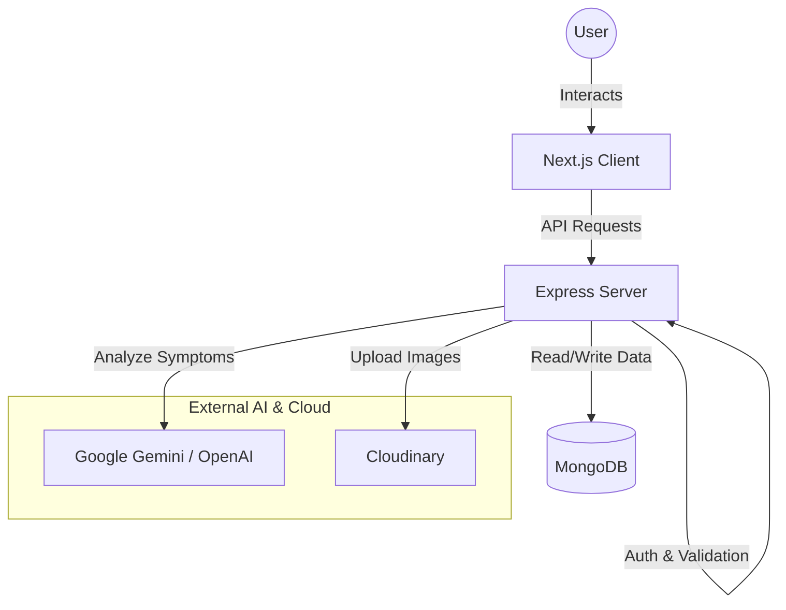
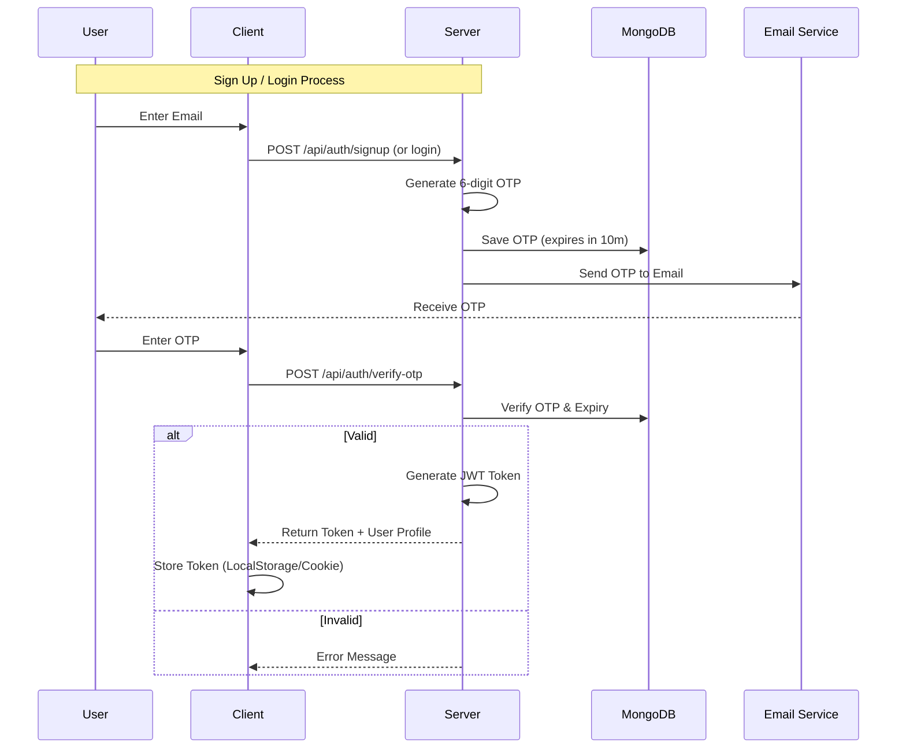
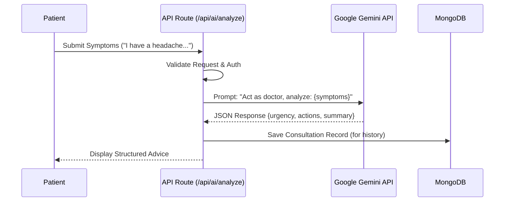
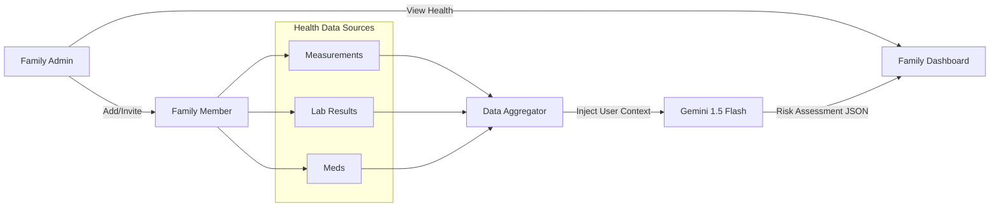
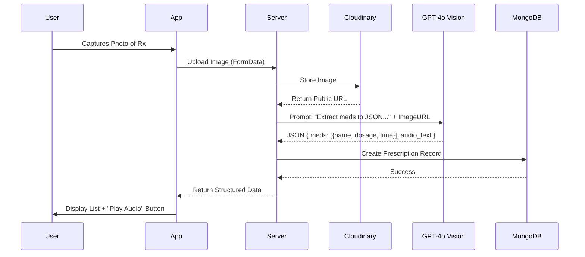
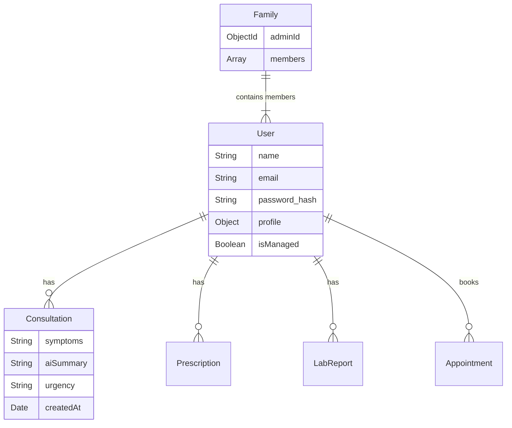

# Technical Flows & Architecture

## 1. System Architecture (DFD Level 1)

This high-level data flow diagram illustrates how users interact with the Lifedoc ecosystem and how data moves between the Client, Server, Database, and AI Services.



## 2. Authentication Flow

Lifedoc uses a custom OTP-based authentication system to ensure security without requiring complex passwords.



## 3. AI Analysis Flow (Symptom Checker)

The core "AI Doctor" feature processes user symptoms using Google Gemini.



## 4. Family Health Guardian Flow

This advanced flow allows a guardian to monitor manageable family members.



## 5. Prescription Processing Pipeline (Sequence Diagram)

This logic handles the complex task of converting a raw image into a scheduled medicine reminder with audio support.



## 6. Database Schema (ER Diagram)

The underlying data model connecting Users, Families, and Health Records.



## 7. Emergency SOS Logic (Round 2 Implementation)

The planned flow for the "One-Tap Rescue" feature.

```mermaid
flowchart TD
    Start((SOS Button Pressed)) --> GetLoc[Get GPS Coordinates]
    GetLoc --> API[POST /api/sos/trigger]
    
    API -->|Async| Parallel
    
    state Parallel {
        direction LR
        SMS[Twilio SMS Service]
        WA[WhatsApp Business API]
        DbLog[Log Incident DB]
    }
    
    SMS --> Family[Family Admin 1]
    SMS --> Family2[Family Admin 2]
    WA --> Amb[Ambulance Service]
    
    Family --> Link[Click 'Live Track' Link]
    Link --> Map[Real-time Maps View]
```
